# Llynfi Valley Angling Association   
## Introduction:   

This website was designed for a local fishing club based in Maesteg, South Wales.   

This website has been created the initial milestone project for Code Institute's Level 5 Full Stack Software Development Diploma. It was built using HTML, CSS and Bootstrap. GitPod was used for writing the code, as well as committing and pushing to GitHub, where it was stored.     

Once all the code had been written, GitPages was then used to deploy the website.     

## Contents  

1. [Introduction](#Introduction)   

2. [User Experience UX](#User-Experience-UX)   

    * [Project Goal](#Project-Goal)  

    * [User Stories](#User-Stories)  

    * [Strategy](#Strategy)  

    * [Scope](#Scope)  

    * [Structure](#Structure)  

    * [Skeleton](#Skeleton)  

    * [Surface](#Surface)  

3. [Features](#Features)  

    * [All Page Features](#All-Page-Features)

    * [Home Page](#Home-Page)

    * [Gallery](#Gallery)
  
4. [Testing](#Testing)  

    * [Accessibility](#Accessibility)

    * [Validation](#Validation) 

5. [User Stories Met](#user-stories-met)

6. [Deployment](#Deployment)

7. [Credits](#Credits)

## User Experience UX:   

### Project Goal:   

To create a site for the Llynfi Valley Angling Association for visitors who want to know more about the club, its offerings and sign up to receive more information.    

### User Stories:   

As a **potential new member**, I want to:   

 ⦁  Be able to easily navigate throughout the site to access the information I want.

 ⦁  Find relevant content about the club including membership prices to inform my choices.

 ⦁  Be able to easily contact the club to be able to find out more information.   

 ⦁  Sign up to a newsletter to get regular updates about the club.

 ⦁  See photos of fish, the river, environment etc to help me decide if I want to join.

### Strategy   

The strategy plane of UX design is the initial phase where decisions about what objectives the product should be designed to meet must be decided. This means looking at user needs, as well product/service objectives. This website’s target audience was broken down into three categories:   

### Roles:
 - New User

#### Demographic:
 - Adults 16+
 - Young People
 - South Wales
 - Likely more males than females

### Psychographic:
#### Lifestyle: 
 - Enjoy outdoor activity

#### Values:
 - Learning new skills  
 - Spending time outdoors  
 - Spending time with family
 - Teaching children new hobbies
 - Health and wellbeing

#### The website needs to allow users to: 
 - View information about the club including membership prices
 - Contact the club if needed  
 - See photos of members, fish, the environment
 - Sign up to a newsletter 

#### The website needs to allow the club:
 - Attract new members  
 - Receive inquiries from site visitors 
- Allow interested parties to receive the newsletter.
 

### Scope   

Within the scope plane, the strategy is transformed into the project specifics, including requirements, defining the characteristics of the product or service and any other value-adding information to be displayed on the website or app.    

#### Content Requirements:   

 * Home page
 * Contact info   
 * Photos/Gallery
 * Membership price details   
 * Newsletter sign up   

#### Functionality Requirements:   

The user will be able to:
 
 * Navigate easily through the site to find the information they need  
 * Sign up to the newsletter 
 * View photos
 * Link to social media sites 

### Structure   

At the structure phase, the platform and user interface (UI) of the site are shaped.    

### Skeleton   

At this level, the exact structure is finalised, including where the interface elements are located on the screen and how they interact with each other.    

[Wireframes](WIREFRAME.md "Link to Wireframe screenshots") were created to set out the initial appearance of the website.  Wireframes were created using [Balsamiq](https://balsamiq.com/).     

### Surface   

This is the final stage where visual design should be designed with the user in mind. The information should be presented appropriately and accessibility should be considered.   

#### Colour Scheme:   

The colour scheme for the project was created by uploading an image of the Llynfi River to [Adobe Color](https://color.adobe.com/create/color-wheel). Adobe Color extracted the colours from the image to create the colour scheme: 

####  Typography:  

The font chosen was imported from [Google Fonts](https://fonts.google.com/). 

El Messiri was chosen as it is similar to the font in the logo. Initially two fonts were used but the second was removed as the one font looked better overall.

## Features 

### All Page Features

#### Header and navigation:

Each page has a Header and Navigation bar section which sit at the top of each page. The navigation bar consists of links to the *Home* page, *About* section, *Membership* section, *Contact Us* section, which are all on the home page, and to a separate *Gallery* page.

Each link works from all pages, including the *404* and *Thank You*, and takes the user to the correct pages/individual sections.

The navigation bar is responsive on smaller screens and the links are replaced by the burger style drop-down.

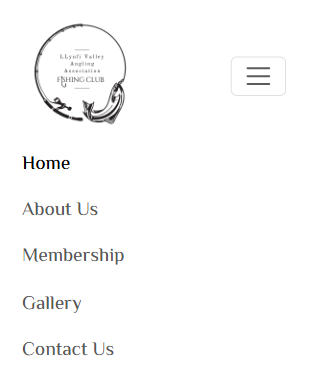

The navigation bar has been made 'sticky'. Which means it appears on the top of the screen when scrolling. This helps the user to be able to access the dropdown and page options whereever they are on the site.

#### Footer:

The footer sits at the bottom of each page. This contains links to LVAA's social media pages. Currently, the LVAA only have a Facebook page, but the other links go to the Instagram and Youtube home pages. Each icon opens in a new tab when clicked.

The footer is simplistic but effective. The simplistic choice allows the footer design to be changed in the future if needed.

#### Hero Image:

The hero image was chosen as it is an attention-grabbing, attractive image of the Llynfi River. It is featured on every page.

The image chosen was used to create the colour scheme for the page so it blends well to the overall design of the page.

The hero image includes the cover text 'LLYNFI VALLEY ANGLING ASSOCIATION'.

### Home Page

#### About Us:

On the *Home* page, under the Hero Image, is the *About Us* section. This section contains the *About Us* information for the LVAA and information about *The River* itself.

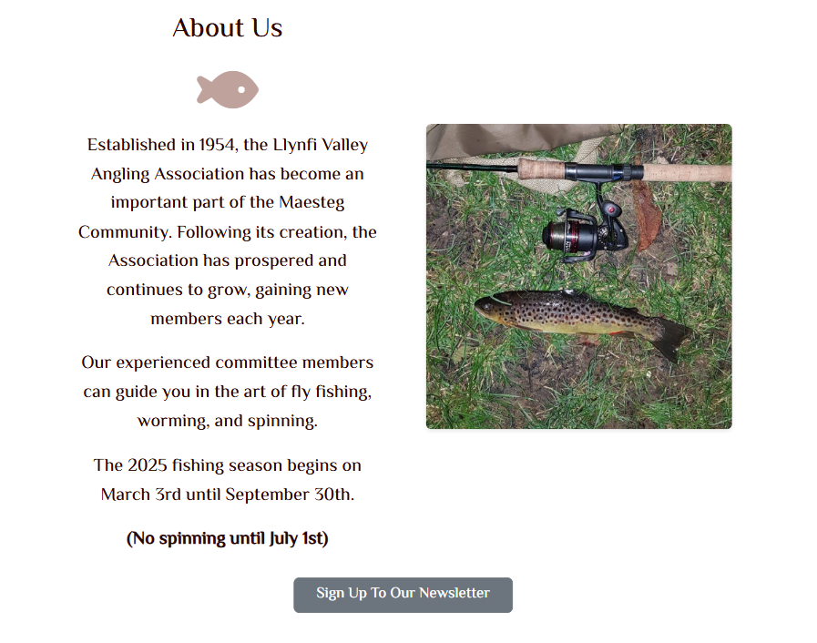

This section is responsive to various screen sizes. On smaller screens it is set out in a scrolling grid with images and wording on top of each other. On larger screens the text and images alternate for a more effective layout.

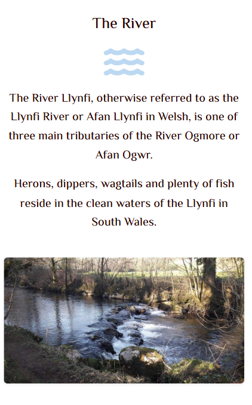

#### Cards:

Underneath the *About Us* section, there are two cards which contain the contact and membership information.

The cards are separate sections which are linked to the navigation bar. 

Cards were chosen for the site as they are flexible content containers that have options to include headers and footers, images background colors, and more and were modified to contain the relevant information needed for the LVAA site.

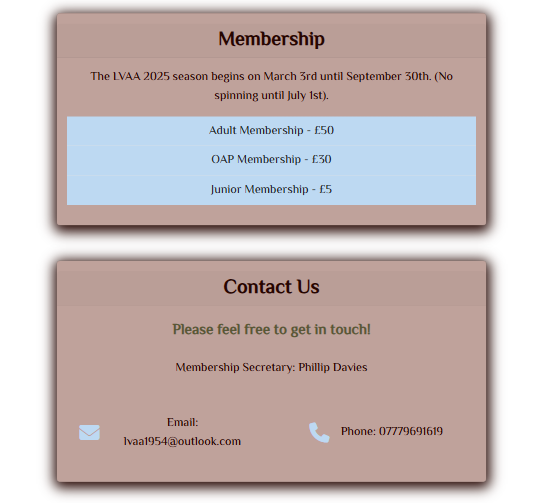

The cards are styled using Bootstrap and CSS for box shadow and to match the colour scheme. 

#### Sign Up Button:

The *About Us* section originally contained the sign up to the newsletter button.

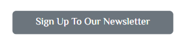

However, when testing it was apparent that it was more suited to the contact us section.

When clicked, a modal pop up opens which contains a form to input first name, last name and email address. The form is responsive to screen size. It also will not let the information be submitted if there are any empty areas or if the email is not correct to ensure the relevant information is collected for the LVAA newsletter to be distributed.

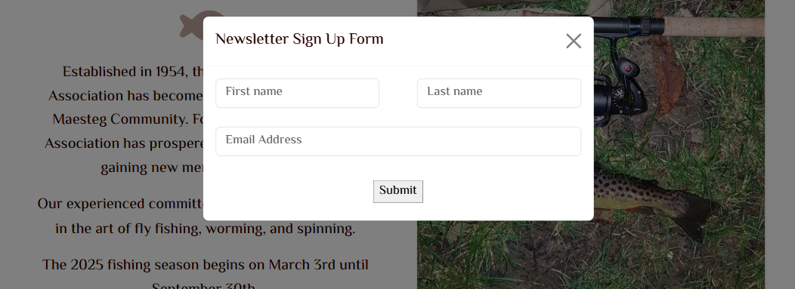

When submitted, the form takes the user to the *Thank You* page.

### Gallery

This is a separate page that contains a variety of images of fish, the river and club members.

The page is responsive on various screen sizes.

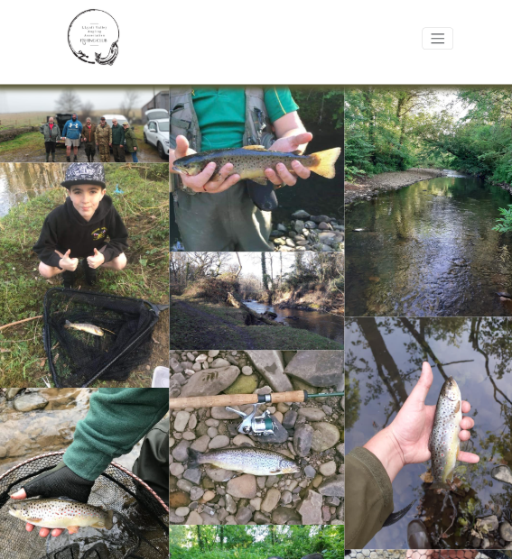

## Testing 

### Bugs:
 - Navbar links did not work from *Gallery* page - now they go to each page/section correctly
 - The modal form layout was incorrect and was not responsive - used Bootstrap to align correctly and respond to screen sizes.
 - The form did not have a submit button - added following testing.
 
 - The *Thank You* and *404* pages did not have any writing on them. So updated to include appropriate messages.
 - The sign up button was moved to the contact us card as it was more of a suitable location.

### Accessibility:

The Lighthouse tool, part of Google Chrome DevTools. The site is ranked at 100 for accessibility on mobile and desktop.

#### Home Page:
#### Mobile:

#### Desktop:

#### Gallery:
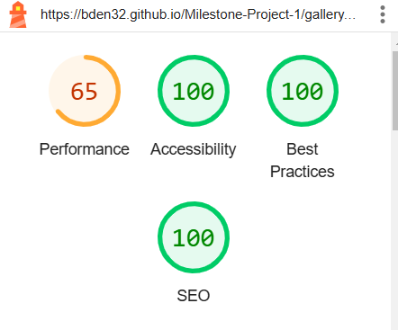

#### Thank You Page:

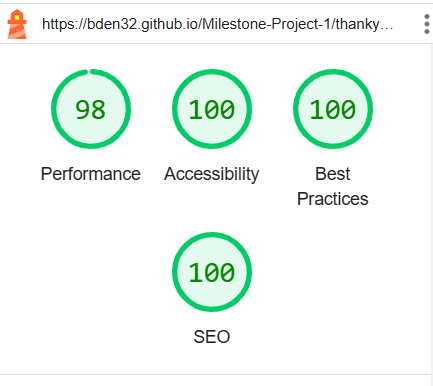

### Validation:
 
The [W3C Markup Validator](https://validator.w3.org/) and [W3C CSS Validator Services](https://jigsaw.w3.org/css-validator/) were used to validate every page of the project to ensure there were no syntax errors in the project.

#### HTML:
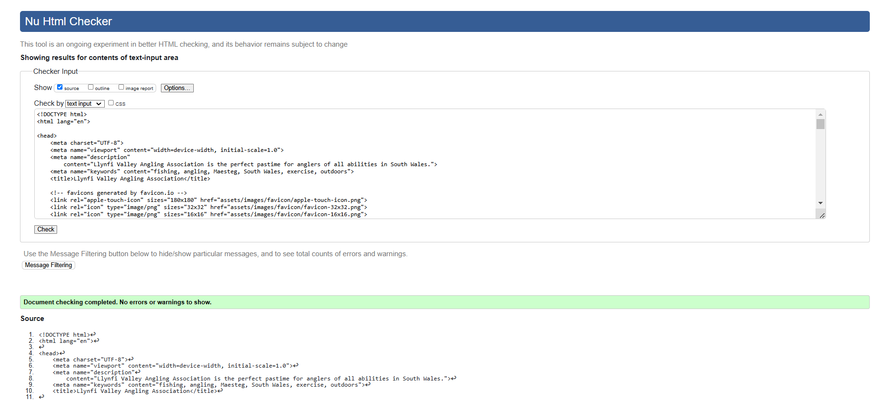

#### CSS:
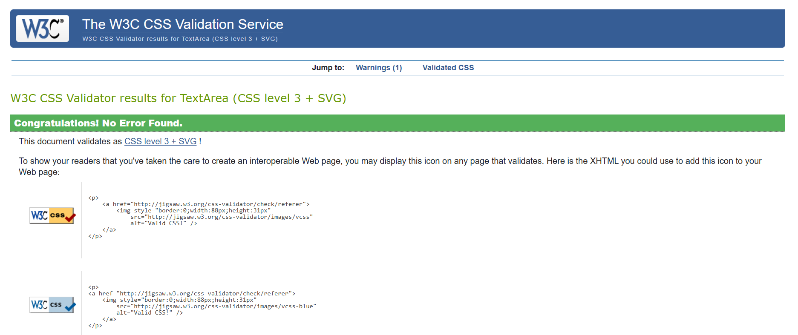

### Browser Compatibility

The deployed site has been across a number of browsers. 
The site's appearance is excellent on all browsers. Responsiveness could be improved on browser for laptops and larger screens.

Firefox cannot be tested as no access to Apple devices.

| Browser Tested | Intended Appearance | Intended Responsiveness |
| -----------    | -----------         | -----------             |
| Chrome         | Excellent           | Good                    |
| Edge           | Excellent           | Good                    |
| Mobile         | Excellent           | Excellent               |

## User Stories Met 

This section looks back at the original User Stories that were established during the strategy phase of the project. 
Ideally, the User stories will be met by through the design of the site.

As a potential new member, I want to:

⦁ Be able to easily navigate throughout the site to access the information I want.

**The site contains a navigation bar, that links to all the pages and sections of the site**

⦁ Find relevant content about the club including membership prices to inform my choices.

**Relevant pages and sections, including a membership section have been included on the site**

⦁ Be able to easily contact the club to be able to find out more information.

**A contact us section with clickable links to the email and telephone are available**

⦁ Sign up to a newsletter to get regular updates about the club.

**A form that allows the user to add name and email is available**

⦁ See photos of fish, the river, environment etc to help me decide if I want to join.

**The site contains a responsive Gallery page with a variety of images**

## Deployment 

The website was developed using Gitpod and was created in the "main" branch of GitHub. This branch was deployed using GitHub Pages. 

To deploy a project, you must:

1. Open GitHub. 
2. Click on the project that is to be deployed from the available repositories.
3. Find the "Settings" tab and click to go to "Settings" page.
4. On the left-hand sidebar, in the "Code and automation" section, select "Pages".
5. Under the "Build and deployment" section, make sure:
    * Source is set to 'Deploy from Branch'.
    * Under Branch that main branch is selected.
    * Folder is set to / (root).
6. Select "save".
7. Go back to the "Code" tab.
8. On the right-hand side, in the "Deployments" section, click on 'github-pages'.
9. A new tab will open, here you can click on your live site! 

 **The pages can take a few minutes to refresh after changes have been made**

## Credits 

### README.md
 * README.md structure adapted from examples shared on Slack by Lewis Dillon, Cohort Facilitator.
 * Instructions on deployment were adapted from the Code Institue coursework

### Images and content:
 * All images, including the logo, that have been used have been provided by the Llynfi Valley Angling Association.
 * The icons used throughout the website were taken from [Font Awesome](https://fontawesome.com/)
 * The fonts were taken from [Google Fonts](https://fonts.google.com/)

### Code:
 * Various coder forums were used when I had issues with specific aspects of the code. [W3Schools](https://www.w3schools.com/) was particularly helpful and provided walkthroughs. [ChatGPT](chatgpt.com) was also used when forums or other websites did not help me to solve issues I came across.
 * The hero image and cover text code was based on the Love Running code from Code Institute.
 * The modal section was created by myself but [ChatGPT](chatgpt.com) supported making it responsive.
